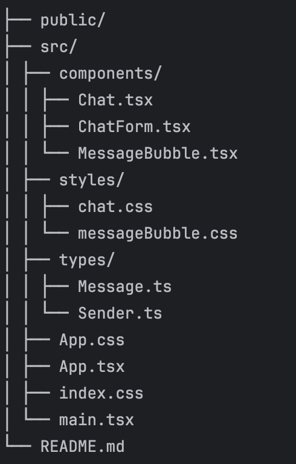

# 💬 FakeMyTest: Generador de Chat de WhatsApp a Imagen

Este proyecto es una aplicación web construida con React que permite a los usuarios simular conversaciones de chat al estilo WhatsApp y exportarlas como una imagen PNG.

## ✨ Características Principales

* **Interfaz Realista:** Diseño, colores, y burbujas de mensaje que imitan la estética de WhatsApp (incluyendo punteros triangulares en las burbujas).
* **Doble Check:** Implementación visual del doble check azul de "Leído" en los mensajes del Usuario 1.
* **Selección de Remitente:** Permite alternar fácilmente entre dos usuarios:
    * **Usuario 1 (Derecha):** Burbuja verde. Muestra el doble check azul de "Leído".
    * **Usuario 2 (Izquierda):** Burbuja blanca.
* **Exportación a Imagen (`.png`):** Utiliza la librería `html-to-image` para capturar el área del chat y generar una descarga automática de la conversación.
* **Diseño Responsivo:** El contenedor del chat está centrado y se adapta a diferentes tamaños de pantalla, mejorando la experiencia móvil.
* **Estilos Modulares:** El CSS está dividido en archivos para una fácil gestión: `App.css` (layout principal), `chat.css` (contenedor del chat) y `messageBubble.css` (detalles de la burbuja).

## 🚀 Tecnologías Utilizadas

* **Frontend:** React (Hooks y Componentes Funcionales)
* **Lenguaje:** TypeScript
* **Estilos:** CSS puro, enfocado en simular la UI de WhatsApp.
* **Utilidades:** `html-to-image` para la manipulación del DOM y exportación.

## 🛠️ Cómo Usar

1.  **Selección:** Elige el remitente (`Usuario 1` o `Usuario 2`) en el menú desplegable.
2.  **Mensaje:** Escribe el contenido en el campo de texto y haz clic en **"Agregar"**. La hora se añade automáticamente.
3.  **Exportar:** Cuando la conversación esté lista, presiona **"Generar imagen"**.
4.  **Limpiar:** Usa **"Limpiar"** para reiniciar la aplicación.

## 📂 Estructura del Código

El proyecto sigue una estructura modular:

